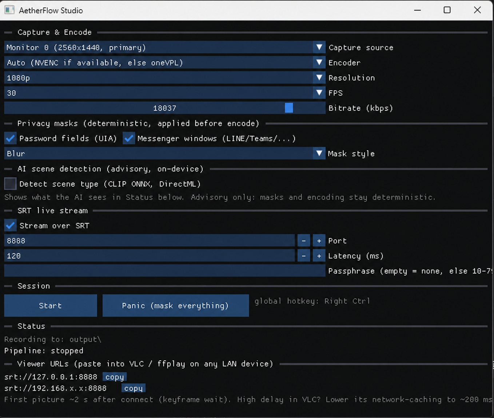

# AetherFlow

A Windows-first, **GPU-resident screen-capture → H.264 pipeline** with deterministic,
pre-encode privacy masking and an optional on-device AI slow path.

AetherFlow is a portfolio-grade systems prototype that demonstrates native media
pipeline design across Windows and macOS, hardware encoder abstraction, fail-closed
privacy behavior, and measurable separation between deterministic realtime work and
probabilistic AI analysis.



*AetherFlow Studio: deterministic password-field and recognized messenger-window
masks are applied before encoding. SRT streams the already-masked output. The ONNX
scene classifier is optional and advisory.*

## What this project demonstrates

### 1. Native GPU media pipeline engineering

- Windows Graphics Capture / DXGI → D3D11 textures
- GPU-side privacy composition and BGRA → NV12 conversion
- NVIDIA NVENC and Intel oneVPL encoder backends
- Optional SRT / MPEG-TS live output
- macOS ScreenCaptureKit → Metal/CoreImage → VideoToolbox → AVAssetWriter path

The main path is designed to keep frames GPU-resident through capture, masking,
conversion, and hardware encode.

### 2. Deterministic realtime behavior around AI

AetherFlow uses two lanes:

```text
Fast lane (per frame, deterministic)
capture -> decision -> privacy mask -> color convert -> encode -> trace

Slow lane (sampled, advisory)
sampled frame -> local analyzer -> cached proposal -> policy / telemetry
```

The fast lane never waits for a remote service or LLM. The optional ONNX classifier
runs off-thread at a droppable sampling rate and does not gate product masking or
encoding.

### 3. Fail-closed privacy masking

The first product wedge is **Live Share Guard**: reduce accidental disclosure during
screen sharing by masking sensitive regions before they reach the encoder.

Current deterministic producers include:

- UI Automation password-field detection
- recognized chat / notification window detection
- manual and panic masks

Mask-processing failure must not silently emit the original frame unmasked. Exact
coverage and remaining gaps are documented in
[`PROJECT_STATUS.md`](docs/1-status/PROJECT_STATUS.md).

## Current evidence

> Point-in-time results from recorded local runs. Re-run before quoting them as
> current release measurements.

| Result | Recorded evidence |
|---|---|
| Windows default smoke | 120/120 frames encoded, 0 encode failures, 0 trace parse errors |
| First-party tests | CTest 4/4 |
| Deterministic decision path | p99 `decisionMs` 0.17 ms in a historical interactive run |
| ONNX slow path | p95 inference 15.254 ms in the recorded smoke run |
| macOS mask stage | mean 5.40 ms / p99 7.14 ms with 11 rectangles per frame |
| SRT loopback | 90 frames decoded by a local FFmpeg client |

Evidence sources and limitations:

- [`docs/HIGHLIGHTS.md`](docs/HIGHLIGHTS.md)
- [`docs/1-status/PROJECT_STATUS.md`](docs/1-status/PROJECT_STATUS.md)
- [`docs/4-qa-debugging/VERIFICATION_HISTORY.md`](docs/4-qa-debugging/VERIFICATION_HISTORY.md)

## Scope and release boundary

This repository is a **pre-release source snapshot**, not a formal binary release and
not a certified DLP product.

Windows is the primary verified path. Several optional paths remain partially verified
or require current hardware evidence, including Intel parity, broader real-application
privacy coverage, long-duration capture reliability, current macOS reruns, and release
packaging/signing.

The concise source of truth is
[`PROJECT_STATUS.md`](docs/1-status/PROJECT_STATUS.md).

## Quick start — Windows

Requirements:

- Windows 10 1903+ or Windows 11
- Intel Gen 6 Skylake+ or NVIDIA Maxwell+ GPU
- Visual Studio / Build Tools 2019 or 2022 with **Desktop development with C++**
- Windows SDK, CMake 3.20+, and Python 3

Recommended setup:

```powershell
Set-ExecutionPolicy -Scope Process Bypass -Force
.\tools\bootstrap_windows.ps1
.\build\Release\AetherFlowStudio.exe
```

The bootstrap fetches the pinned UI and FFmpeg/SRT dependencies required by the
showcased Studio path. NVENC still requires one NVIDIA SDK header supplied by the
user. ONNX Runtime and the model are optional and remain a manual setup.

Manual core build:

```powershell
cmake -S . -B build -G "Visual Studio 17 2022" -A x64
cmake --build build --config Release --target AetherFlow
.\build\Release\AetherFlow.exe
```

Useful entry points:

```powershell
.\demo.ps1
.\run_full_test.ps1
python tools\agent_run.py --run-id smoke
python tools\agent_verify.py --run-dir .aetherflow\runs\smoke
```

Full setup, flags, packaging, SRT, ONNX, and macOS instructions live in
[`docs/OPERATION_GUIDE.md`](docs/OPERATION_GUIDE.md) and
[`docs/BUILD_WINDOWS.md`](docs/BUILD_WINDOWS.md).

## Repository map

- [`docs/HIGHLIGHTS.md`](docs/HIGHLIGHTS.md) — 60-second technical summary
- [`docs/3-product/ARCHITECTURE.md`](docs/3-product/ARCHITECTURE.md) — runtime and platform architecture
- [`docs/1-status/PROJECT_STATUS.md`](docs/1-status/PROJECT_STATUS.md) — current capability and verification boundary
- [`docs/4-qa-debugging/VERIFICATION_HISTORY.md`](docs/4-qa-debugging/VERIFICATION_HISTORY.md) — dated measurements and runs
- [`docs/4-qa-debugging/TROUBLESHOOTING_QA.md`](docs/4-qa-debugging/TROUBLESHOOTING_QA.md) — QA matrix and debugging records
- [`docs/OPERATION_GUIDE.md`](docs/OPERATION_GUIDE.md) — full operating guide
- [`protocol/COMPONENT_INDEX.md`](protocol/COMPONENT_INDEX.md) — component ownership map

## Development provenance

AetherFlow was developed through an **author-directed, AI-assisted engineering
workflow**.

The author defined the product problem, architecture, constraints, verification
criteria, acceptance boundaries, and review gates. Coding agents produced much of the
implementation and documentation under a repository-based protocol with separate
planning, implementation, verification, repair, and review responsibilities.

This repository intentionally exposes that workflow rather than presenting the code as
line-by-line manual authorship:

- [`AGENTS.md`](AGENTS.md)
- [`docs/2-agent-system/AGENT_ARCHITECTURE.md`](docs/2-agent-system/AGENT_ARCHITECTURE.md)
- [`docs/2-agent-system/AGENT_EFFECTIVENESS_LOG.md`](docs/2-agent-system/AGENT_EFFECTIVENESS_LOG.md)

The engineering claim is therefore not “every line was handwritten.” It is that the
system was specified, constrained, integrated, tested, and audited as a coherent native
media prototype.

## License

AetherFlow source is released under the [MIT License](LICENSE). Bundled or fetched
third-party components retain their respective licenses; see the source notes under
`external/` and `third_party/`.
